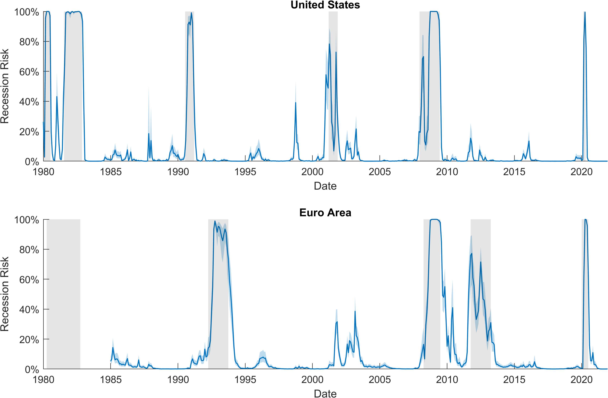

# Nowcasting Recession Risk


## Abstract

We propose a simple yet robust framework to nowcast recession risk at a monthly frequency in both the United States and the Euro Area. Our nowcast leverages both macroeconomic and financial conditions, and is available the first business day after the reference month closes. In particular, we argue that financial conditions are not only useful to predict future downturns–as emphasized by the existing literature–but they are also useful to distinguish between expansions and downturns as they unfold. We then connect our recession risk nowcast with growth-at-risk by drawing on the literature on distributional regressions and quantile regressions. Finally, we benchmark our nowcast with the Survey of Professional Forecasters (SPF) and show that, while both have a similar ability to identify downturns, the former is more accurate in correctly identifying periods of expansion.

<p align="center">
  
  <br />
  <br />   
  <span>
    Recession Risk Nowcast in the United States and the Euro Area
  </span>
</p>


## Instructions for Replication

To replicate the results of the paper, open `MAIN.m` and run each .m script sequentially. 

You will first need to generate `Data.mat`, which can be done by running `Build_Data.m`. This will require a valid Haver token not provided by us. A Haver subscription with a valid Haver token is the simplest way to gather the required data. If you do not an Haver subscription, but do have access to the underlying data, you just need to manually create a `Data.mat` with the same structure as `Data_Template.mat` in the folder `Data`.

Some results require additional data not available in Haver. Please follow the instructions in the replication package. 

The settings for Bayesian estimation can be found in  `Subfunctions/Get_Parameters.m`. The default value for the number of draws is 5e4. For a faster replication, set the value to 1e3 but expect small differences with the published results.

### Compatibility

Verified compatibility: MATLAB 2022, MATLAB 2023.


## Paper

The paper will appear as a chapter in **Research Methods and Applications on Macroeconomic Forecasting**, edited by Ana Galvão and Michael P. Clements.

**Amazon Science Portal**: https://www.amazon.science/publications/nowcasting-recession-risk
**SSRN Portal**: https://papers.ssrn.com/sol3/papers.cfm?abstract_id=4706700


## Authors

Francesco Furno, Domenico Giannone


## Citation

If you find this work useful, please consider citing as follows:
```
@article{furno2024nowcasting,
  title={Nowcasting Recession Risk},
  author={Furno, Francesco and Giannone, Domenico},
  journal={Research Methods and Applications on Macroeconomic Forecasting},
  year={2024}
}
```

## Security

See [CONTRIBUTING](CONTRIBUTING.md#security-issue-notifications) for more information.

## License

This project is licensed under the Apache-2.0 License.
